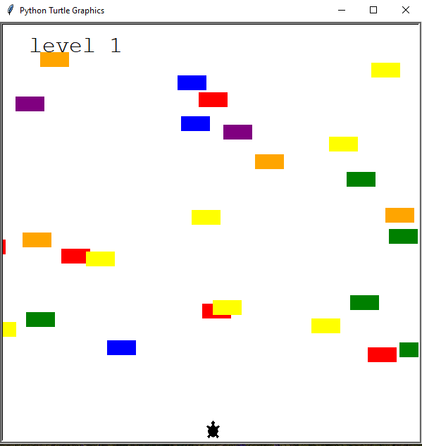

# Turtle crossing game using turtle graphics.

## Navigate a turtle through a dangerous crossing while avoiding moving obstacles in this turtle graphics-based game.

### Description

The game was part of a python course i was doing. It was a project in the course. Clone the project and run main.py to start the game. Guide the turtle up and avoid obstacles to get to next level.

Gameplay Highlights:
- Use the up arrow key to guide the turtle upwards through a vertical path.
- No turning back – the turtle can only move forward.
- Dodge moving obstacles that increase in speed with each level.
- Continuous gameplay with no end level.
- Game over if the turtle collides with an obstacle.

